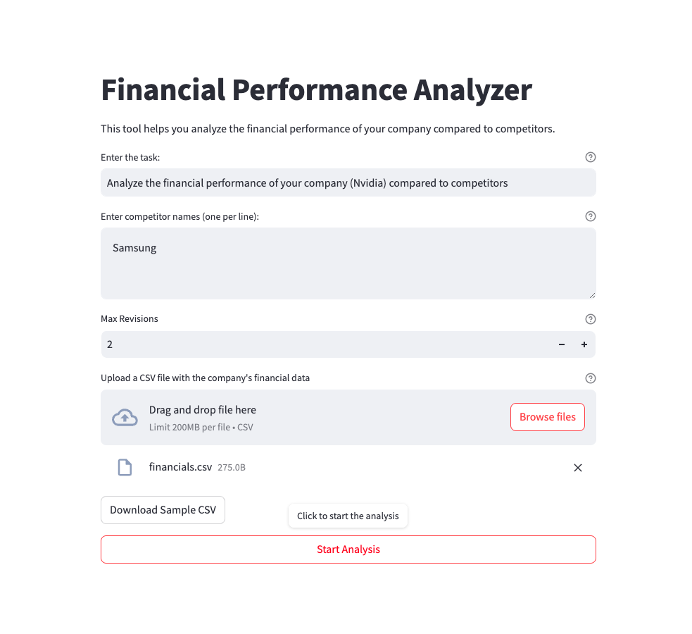

# Financial Performance Analyzer

This project provides a web-based application for analyzing and comparing the financial performance of a company against its competitors. It leverages various machine learning models and APIs to gather, analyze, and report financial data. The app is built using Streamlit and integrates with OpenAI, Tavily, and Langchain for data processing.



## Project Structure

```bash
/finance-performance-analyzer
│
├── app.py             # Main Streamlit app (UI and integration logic)
├── config.py          # Configuration and environment variables
├── models.py          # Data models
├── nodes.py           # Node functions for processing state
├── prompts.py         # Predefined prompts used in nodes
└── state_graph.py     # State machine and graph setup
└── .env               # Environment variables (API keys)
├── requirements.txt   # Python dependencies
└── README.md          # Project documentation
```

## Setup

#### Development Environment Setup

1. Install Python (version 3.8 or higher).
2. Set Up a Virtual Environment:

```bash
$ python3 -m venv venv
$ source venv/bin/activate
```

3. Install Dependencies: 

```bash
$ pip install -r requirements.txt
```

#### Installation

1. Download or Clone the Project:

```bash
$ git clone git@github.com:erdimollahuseyin/finance-performance-analyzer.git
$ cd finance-performance-analyzer
```

2. Environment Variables: Create a `.env` file in the root of your project directory and add the following variables:

```
OPENAI_API_KEY=your_openai_api_key
TAVILY_API_KEY=your_tavily_api_key
```

3. Run the Application:

```bash
$ streamlit run app.py
```

#### Environment Variables

- **OPENAI_API_KEY:** API key for OpenAI (GPT models).
- **TAVILY_API_KEY:** API key for Tavily (search functionality).

## Features

- **Financial Data Gathering:** Collects financial data from a CSV file.
- **Data Analysis:** Analyzes the financial data to extract insights.
- **Competitor Research:** Gathers data about competitors using search queries.
- **Performance Comparison:** Compares the financial performance of a company with its competitors.
- **Feedback Loop:** Allows for multiple revisions of the analysis and report based on feedback.
- **Report Generation:** Generates a detailed financial performance report.

## Example Scenarios

#### Scenario 1: Apple vs. Samsung: Performance Comparison in the Mobile Technology Sector

**Objective:** Analyze Apple’s financial performance and compare it with Samsung in the mobile technology sector to identify strengths and weaknesses.

- **Task:** Analyze Apple’s financial performance and compare it with Samsung.
- **Competitors:** Samsung
- **Data:** Financial data for Apple and Samsung for the past 3 years (Income Statement, Balance Sheet, Cash Flow).
- **Process:**
    - Analyze Apple’s financial data.
    - Research Samsung’s financial data.
    - Compare financial performance between the two companies.
    - After receiving feedback, revise the report.
    - Prepare the final report for stakeholders.

**Outcome:** A detailed financial report showing the financial performance of Apple and Samsung in the mobile technology sector, focusing on revenue, profit margins, and market share.

#### Scenario 2: Tesla vs. General Motors: Evaluation of Electric Vehicle Market Performance

**Objective:** Analyze Tesla's performance in the electric vehicle market and compare it with General Motors.

- **Task:** Analyze Tesla’s financial performance and compare it with General Motors.
- **Competitors:** General Motors
- **Data:** Tesla and General Motors financial data for the past 2 years (Revenue, Net Profit, R&D Expenditures).
- **Process:**
    - Analyze Tesla's electric vehicle financial data.
    - Research General Motors' investments and performance in electric vehicles.
    - Compare financial performance between the two companies.
    - Prepare a report after collecting feedback.
    - Final report on the electric vehicle market potential.

**Outcome:** A report showing Tesla’s strengths and potential weaknesses in the electric vehicle market, compared to General Motors, using metrics like revenue, profit, and market expansion.

#### Scenario 3: Amazon vs. Walmart: Retail Sector Financial Comparison

**Objective:** Compare Amazon’s performance in the retail sector with Walmart’s financials.

- **Task:** Analyze Amazon’s financial performance and compare it with Walmart.
- **Competitors:** Walmart
- **Data:** Financial data for Amazon and Walmart for the last 3 years (Net Revenue, Operating Expenses, E-commerce Growth).
- **Process:**
    - Analyze Amazon’s retail revenue streams.
    - Research Walmart’s retail performance.
    - Compare growth rates, profitability, and e-commerce trends.
    - After feedback, revise the report.

**Outcome:** A financial report that contrasts Amazon and Walmart’s retail sector performance, focusing on revenue, profitability, and market share, especially in the e-commerce space.

#### Scenario 4: Microsoft vs. Google: Software and Cloud Computing Market Comparison

**Objective:** Compare Microsoft’s financial performance with Google’s performance in software and cloud computing.

- **Task:** Analyze Microsoft’s financial data and compare it with Google in software and cloud computing.
- **Competitors:** Google
- **Data:** Microsoft and Google’s annual reports, cloud computing revenue, R&D spending.
- **Process:**
    - Analyze Microsoft’s software and cloud revenue.
    Research Google’s cloud and software performance.
    Compare their financial performance and market positions.
    After feedback, finalize the report.

**Outcome:** A report showing the comparative position of Microsoft and Google in the cloud computing sector, highlighting their revenue, profitability, and growth prospects.

#### Scenario 5: Facebook (Meta) vs. Twitter: Social Media Sector Financial Analysis

**Objective:** Compare the financial performance of Facebook (Meta) and Twitter in the social media sector.

- **Task:** Analyze Meta's financial performance and compare it with Twitter.
- **Competitors:** Twitter
- **Data:** Meta and Twitter’s annual reports, advertising revenue, user growth.
- **Process:**
    - Analyze Meta’s advertising revenue and user growth.
    - Research Twitter’s financial performance in advertising and user engagement.
    - Compare their financial performance in the social media market.
    - Revise the report after feedback is received.

**Outcome:** A financial comparison report highlighting the key differences between Meta and Twitter, focusing on their advertising revenue, user growth, and market performance.
